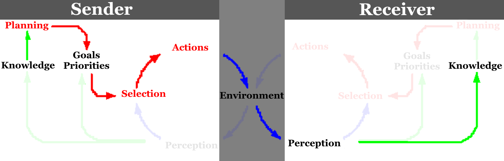

# 1. Introduction

## Basic Assumptions about Language

Basic assumptions:

- **Embodiedness**
  - "Language affected by and transmitted via *the body*"
- **Embeddedness**
  - "Language affects and is affected by *social situations*"
- - brain’s evolution is co-determined by social developments
- **Mental Models**

  - "Humans *represent* the world *internally*"
- - includes perceptual, spatial, emotional, causal and temporal info
- **Incremental Processing**

  - "Humans process language *over time* and *in parts*"
- - when analyzing messages, stores info is compared to the incoming signal (lexically, syntactically, semantically and world-knowledge-y) including emotion and motor aspects

## Language and Communication

**Communication:** *“Every action with which a person exchanges information (about needs, desires, perceptions, knowledge or affective states). Can be intentional or unintentional.”*

- No principled separation between language and other cognitive domains, since cognitive systems are modular (as can be seen in sign language).

Types of context:

- **Physical** 

  - e.g. location, time, temperature, situation of participants

- **Historical**

  - shared information (i.e. common ground)
- **Psychological**

  - perception of self and others
- **Cultural**
  - shared knowledge systems (e.g. attitude, values, behaviours)

  

**Message:** *“Consists of complex meanings, expressed via both verbal and non-verbal symbols”*

**Symbol:** *“Can be words, sounds and actions. Supported by facial expressions, gestures and intonation”*

**Encoding:** *“Turning ideas and feelings into messages”*

**Medium (of the message):** *“Any technology that created extensions of the human body and senses”*

- The “form” of the message (e.g. how spoken words are said)

- Considered as part of the message:

- - media create their own environments. Which are beneficial to some messages and hostile to others. Which influence the interpretation of the message.
  - people might be unaware of the effects of the environment their messages reside in, because they don’t know any better

Language can be seen as a medium that extends human senses, in the sense of:

- **motor behaviour** (expressions can be seen as actions)
- **perception** (getting information from far away, e.g books)
- **emotion** (e.g. hearing a sad story makes you sad)
- **memory** (using language to record a memory)

Humans communicate via their 5 sensory channels. Using multiple channels *simultaniously* increases the chance for successful communication.

**Noise:** *“Any stimulus that disrupts the sharing of meaning”*

- includes internal stimuli like being tired
- **Semantic noise**: "unintended meaning"

**Feedback**: *“Any reaction to messages that indicate that the message came across/is understood”*

## Evolution of language

- Broca’s area was likely already present 2 million years ago

- We’ve had fundamental speech apparatus structures for 60.000 years

- The shapes of our tongues, mouths and throats allows us to make many different sounds but also gives us too many teeth and an increased risk of choking

- **Two theories** of evolution of language:

- - **Discontinuous**: language arose suddenly and spread quickly due to evolutionary advantages and passing the ability to offspring.
  - **Continuous**: gradual co-evolution of language and other human capabilities.

- **Theory** on why **communication** was beneficial for evolution:

- - Internal representation of the world proved to be a huge advantage in protecting the body.

**MacWhinney’s 4 periods of co-evolution: (Continuous theory)**

| Name                                          | Features                         | Period                       |
| --------------------------------------------- | :------------------------------- | ---------------------------- |
| Two Legs                                      | cognitive control planning  | 8 - 4 million years ago      |
| Social Cohesion                               | vocal-auditory neuronal changes  | 4 - 2 million years ago      |
| Mimesis                                       | gestures signs singing | 2 - 0.1 million years ago    |
| Phonological and Lexical systematization | -                                | 0.06 million years ago - now |

   

| Sender-Receiver Model                                        |                      |
| ------------------------------------------------------------ | -------------------- |
| The sender encodes meaning into a message and sends it through a channel.The receiver decodes the received message into meaning.   Certain factors (such as noise) can result in differences between the encoded and decoded message.  The Sender-Receiver model can be seen as a simplified version of two "perception-action models" interacting. This is also in line with the **LUF** |  |

| Two "perception-action models" interacting                   |                     |
| ------------------------------------------------------------ | ------------------- |
| Here the receiver approximates the mental state of the sender via **prediction** or **integration**.  _"**Prediction** (could be defined as)activating information that will come up before it's even there"_  **Integration** happens when feedback is used to update your mental model about the situation. |  |

## Language User Framework

_Framework_ instead of _model_, because models are much more specific and specifies interactions, it's more like a "systematic inventory of all you need when you listen or speak"

Distinguishes between **Language Comprehension** and **Language Production**. The Sender-Receiver Model can also be explained via the LUF. The LUF needs a certain number of components for this:

- **Representation & Rules** (LTM)
- **Processing Components** (e.g. sentence parser)
- **Working Memory** (STM)
- **Cognitive & Attentional Control, and Monitoring**

**Lexical**, **Syntactic** and **Semantic** information is processed **IN PARALLEL**

# 2. Research Techniques

# 3. Spoken Word Recognition

# 4. Printed Word Recognition

# 5. Sentence Processing

# 6. Word and Sentence Meaning

# 7. Language Production

